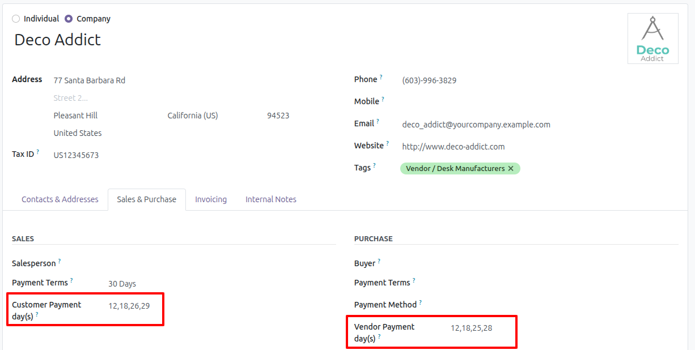
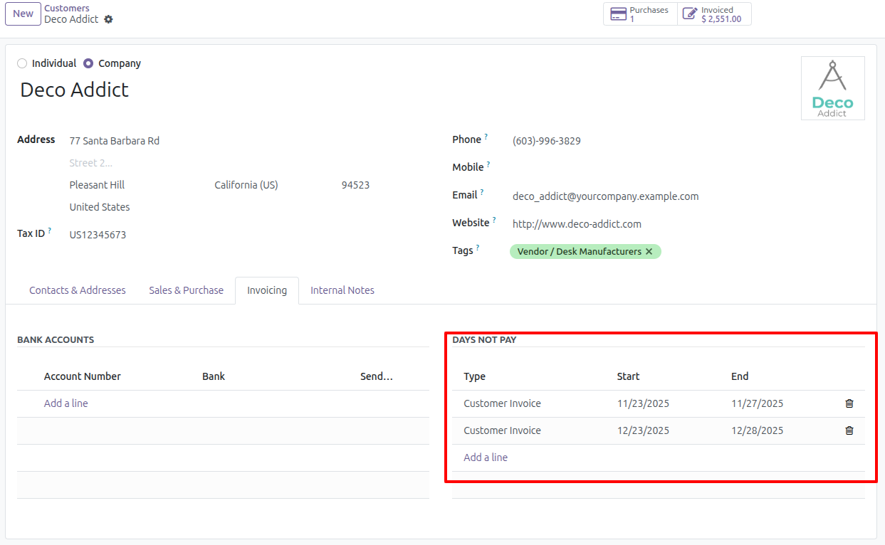
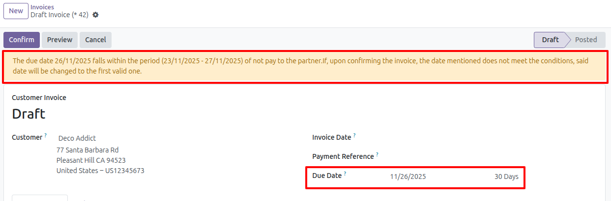

Set payment days per customer
---------------------------------

1. Go to Invoicing > Customers > Customers
2. Select or create a new partner
3. Go to tab "Sales & Purchases" in section "SALES"
4. Enter the payment days separated by commas (,), dashes (-) or spaces ( ) in field Customer Payment day(s).
   Example: 12,18,26,29

   

5. Save

Add range not pay to partner
------------------------------

1. Go to Invoicing > Customers > Customers
2. Select or create a new partner
3. Go to tab "Invoicing" in section "DAYS NOT PAY"
4. Add the range of days not pay
5. Save

   

Create invoice with partner configured for non-payment days
--------------------------------------------

1. Go to Invoicing > Customers > Invoices
2. Create a new invoice and select a partner that has configured no-payment ranges.
3. If, when selecting the partner, today's date falls within a non-payment range, a notification message will be
   displayed.

   

4. You can manually change the due date to a valid range if desired.
   Otherwise, when confirming the invoice, it will be set to a valid date based on the following conditions:

   1. If no payment days are configured, the default day (usually today) will be used.

   2. If a valid due date is not configured, the due date will be set based on the partner's payment days and invalid date ranges.

      Example:
       Partner Mitchell:
        - Payment Days: 5, 17
        - Payment Terms: 30 days
        - Non-Payment Range: 8/1/2025 - 8/31/2025 (Customer Invoice)

      Invoice:
       Partner: Mitchell
       Invoice Date: 7/15/2025
       Due Date: 8/15/2025 (30-day payment terms)
     Since the due date falls within a non-payment range, it is changed to 9/17/2025, as 17 is one of the customer's payment days and is later than 15 in a valid date range.

